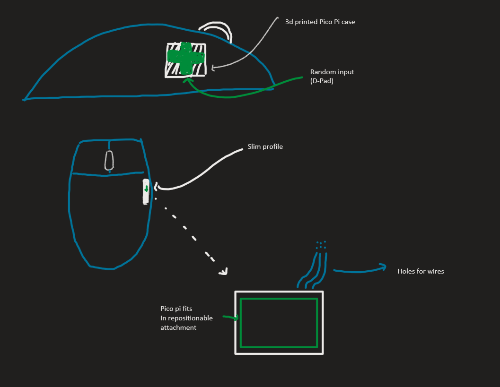

# SEG4105 Lab 3/Deliverable 1

| Outline | Value |
| --- | --- |
| Course | SEG 4105 |
| Date | Fall 2023 |
| Student | Marco Vethanayagam, mveth103@uottawa.ca |
| TA | Shabnam Hassaniahari, shass126@uottawa.ca   Ali Mirferdos , smirf045@uottawa.ca| 
| Team | Marco Vethanayagam 300121798  |

# Lab 3/Deliverable 1

### Fat Marker Sketch

### Problem
Using a computer in the modern age can be daunting considering all the different types of inputs and shortcuts that exist. It becomes an even harder challenge when considering those with accessibility needs. The current landscape of computer peripherals is that one needs to seek out specialized products if one has accessibility needs. This is because most modern, mass-created computer peripherals have no accessibility functionality attributed to the minuscule population who would truly require it. Our capstone product aims to solve this issue by creating a mouse attachment that can be used with any mouse and can meet accessibility needs. With the software functionality created, our current problem is that the hardware we are using for the mouse attachment product has no true way of being mounted to a mouse. 

### Appetite
The time allocation for this is 6 weeks. This ensures that any work is done in a timely manner and doesn't derail the entire project as a whole. Furthermore, with the current team allocation for this, 6 weeks is ample enough time to create a viable solution; it shouldn't constrain the solution.

### Solution
We need to create a mouse attachment that can emulate keyboard inputs/shortcuts whilst also being repositionable and attachable on any mouse. Though the Pico Pi created all of the expected software functionality, we need to create a housing for the Pico Pi that doesn't hinder its functionality whilst creating the repositionable and attachable functionality. The solution to this requires the design and implementation of 2 key parts. The first part is a PLA casing for the Pico Pi that can perfectly house it whilst not hindering its functionality and ability to get power/connect to a PC. It should have some way of opening itself up and closing for testing and maintenance purposes. The second part is some form of attachment apparatus that can physically attach the Pico Pi casing to the mouse, allow it to be removed, and repositioned on the mouse. For this, we want to explore the use of Velcro and magnetized solutions.

### Rabbit Holes
The PLA casing part of the solution has no foreseeable rabbit holes as all that needs to be done is to create a size-appropriate case with enough holes for any necessary wiring. For the attachment apparatus between casing and the mouse, we should avoid any solutions that create permanent attachments such as, but not limited to, glue; it goes against client specifications and also leads to a rabbit hole where time and resources are wasted on a dead-end solution. We should also avoid any attachment options involving the bottom of the mouse as that reduces the respective mouse's effectiveness.

### No Gos
We aren't exploring new hardware input ideas (i.e buttons, joystick) in this as it isn't related to the pitch's problem. We also aren't exploring the use of other single-board computers beyond the Raspberry Pico Pi so the casing created should only consider the specific dimensions of the Pico Pi and no other hardware.
