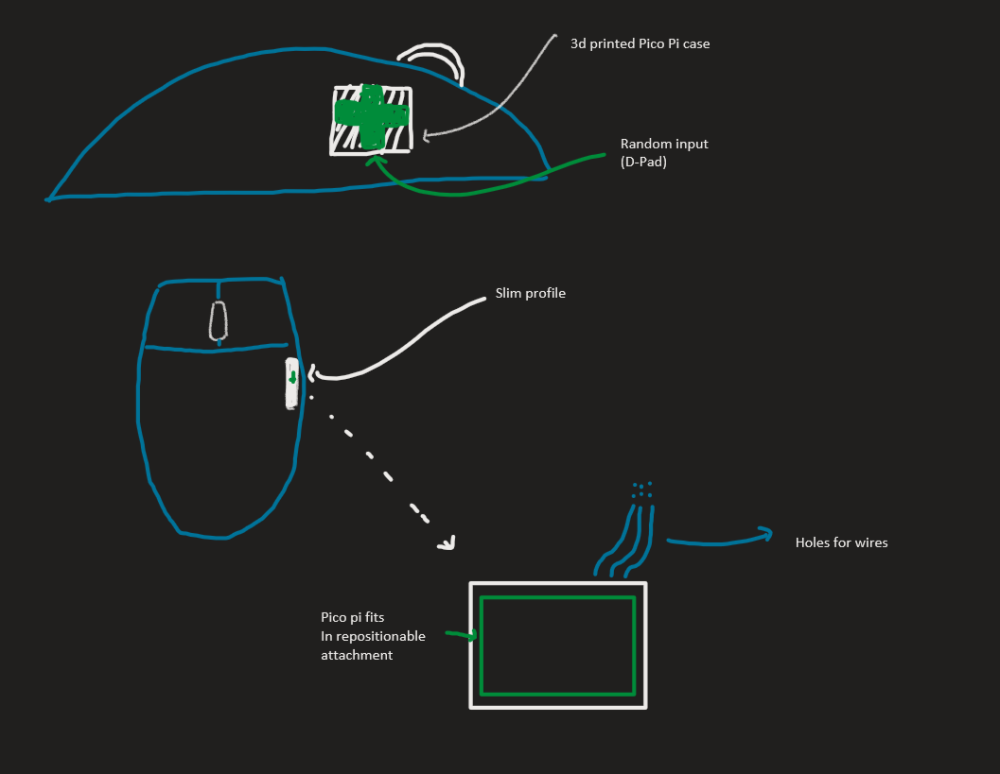

# SEG4105 Lab 4

| Outline | Value |
| --- | --- |
| Course | SEG 4105 |
| Date | Fall 2023 |
| Student | Marco Vethanayagam, mveth103@uottawa.ca |
| TA | Shabnam Hassaniahari, shass126@uottawa.ca   Ali Mirferdos , smirf045@uottawa.ca| 
| Team | Marco Vethanayagam 300121798  |

# Lab 4

### Fat marker sketch

