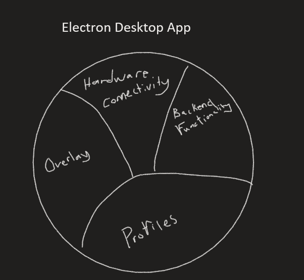

# SEG4105

| Outline | Value |
| --- | --- |
| Course | SEG 4105 |
| Date | Fall 2023 |
| Student | Marco Vethanayagam, mveth103@uottawa.ca |
| TA | Shabnam Hassaniahari, shass126@uottawa.ca   Ali Mirferdos , smirf045@uottawa.ca| 
| Team | Marco Vethanayagam 300121798  |

# Lab 6: Hill Charts

## Scopes

The scope that I will be focusing on is the Backend Functionality. Specifically, it is the expansion of the backend functionality to handle overlays, as well as setting up authentication and profiles for the desktop app.

## Tasks

