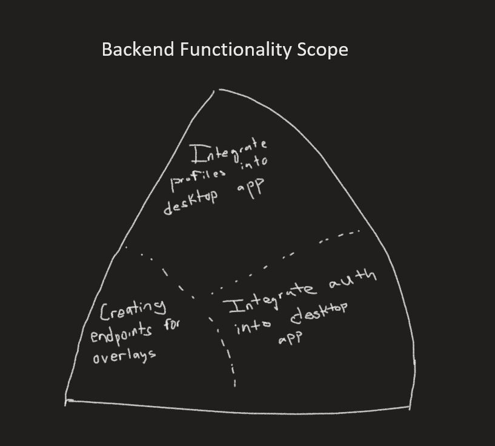
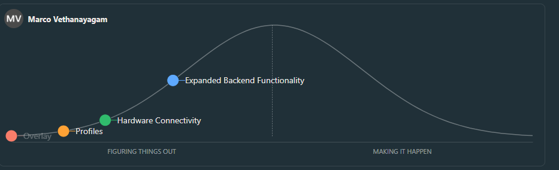
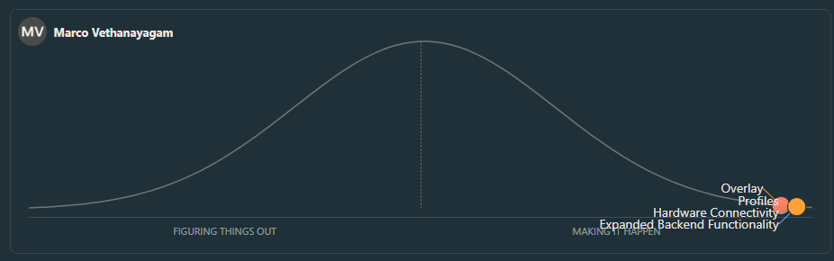
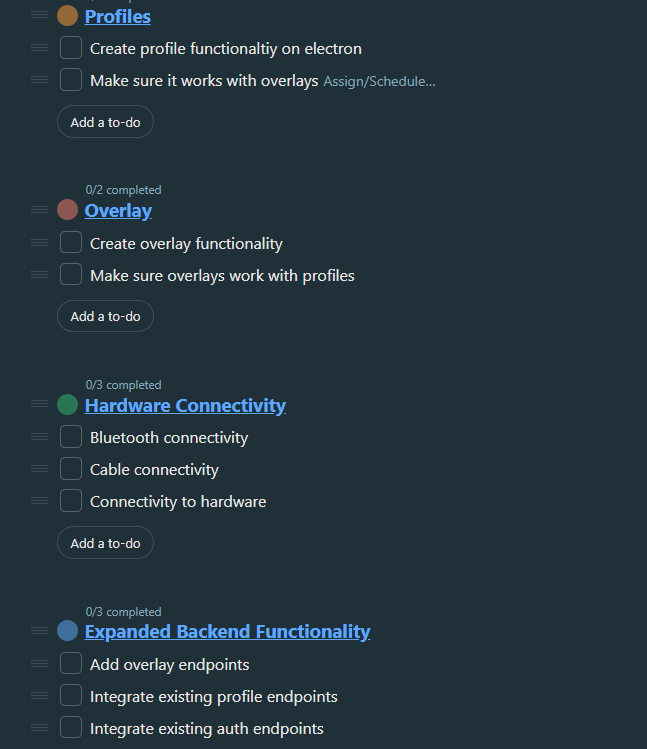
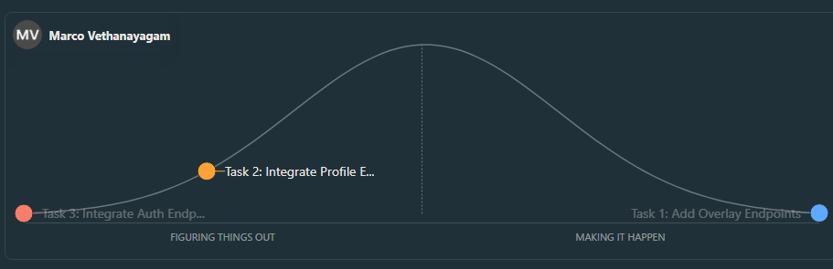
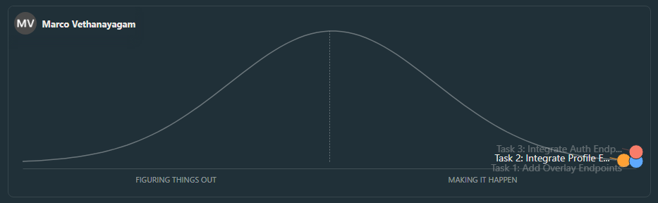
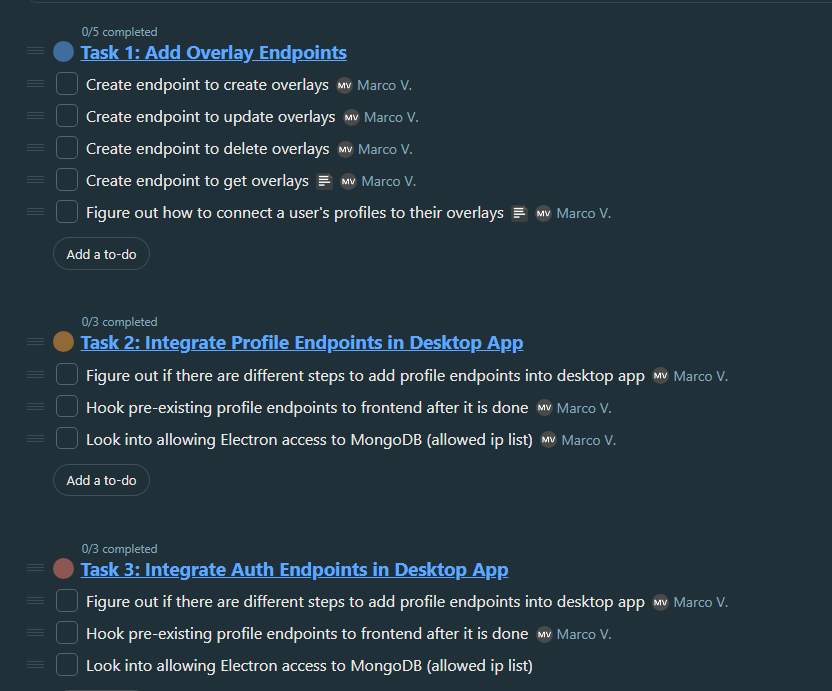

# SEG4105

| Outline | Value |
| --- | --- |
| Course | SEG 4105 |
| Date | Fall 2023 |
| Student | Marco Vethanayagam, mveth103@uottawa.ca |
| TA | Shabnam Hassaniahari, shass126@uottawa.ca   Ali Mirferdos , smirf045@uottawa.ca| 
| Team | Marco Vethanayagam 300121798  |

# Lab 6: Hill Charts

## Scopes

The scope that I will be focusing on is the Backend Functionality. Specifically, it is the expansion of the backend functionality to handle overlays, as well as setting up authentication and profiles for the desktop app.

## Tasks

In relation to this scope, there are three main features:
- Add new endpoints/backend functionality for overlays
  - Adding items to overlays
  - Saving overlay presets
  - Connecting overlays to profiles
  - Allowing use to save images to an overlay
- Integrate auth into the desktop app
  - Pre-existing auth endpoints being added to Electron
- Integrate profiles into the desktop app
  - Pre-existing profile endpoints being added to Electron
  - New ffunctionality connecting profiles to overlays
 
## [Hill Charts](https://3.basecamp.com/5682131/buckets/34775393/todosets/6656014273)
## Scopes
### Original Chart

### Partial Progress Chart

### Full Chart

### Sub-Tasks

## Tasks
### Original Chart

### Chart (1/3)

### Chart (3/3)

### Sub-Tasks

